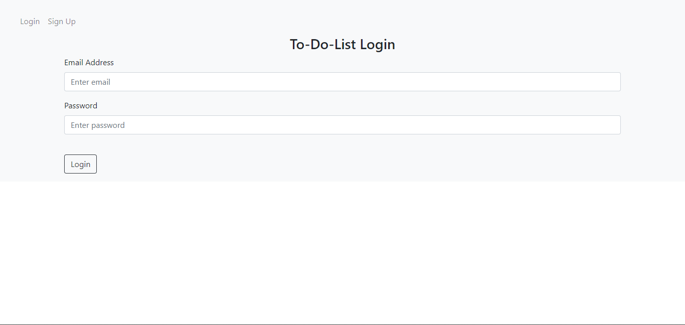
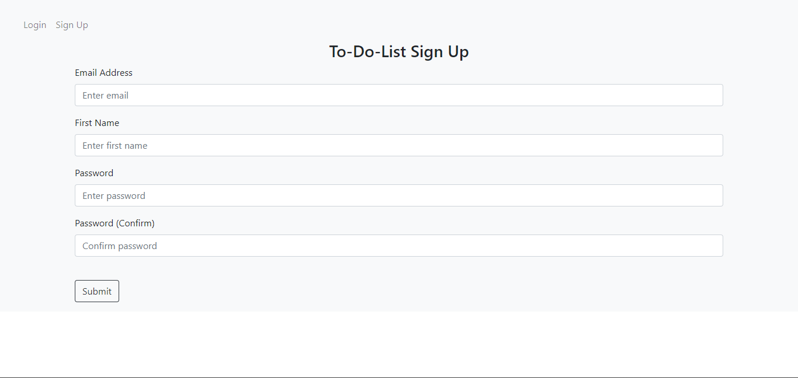
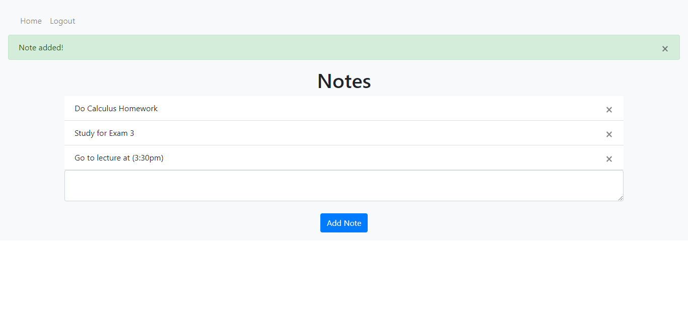

# To-Do-List Python Program


## What I Learned/Project Covers

```
- Directory Structure
- Creating Routes/Views
- Jinja Templating Language & HTML Templates
- Login & Sign Up Page HTML 
- HTTP Requests (POST, GET, etc.)
- Handling POST Requests
- Flask SQLAlchemy Setup
- Database Models, Foreign Key Relationships, & Database Creation
- Creating New User Accounts & Logging In Users 
- Checking if User is Logged In & Notes HTML
- Adding User Notes & Deleting User Notes
```


## Pictures

Login Screen:
 

Sign Up Screen:


Task Adding Screen:



## Setup & Installation 

Make sure you have the latest version of Python installed.


## Requirments (Install)
```
pip install flask
pip install Flask-SQLAlchemy
pip install flask-login
```

## Viewing The App

Go to `http://127.0.0.1:5000`
