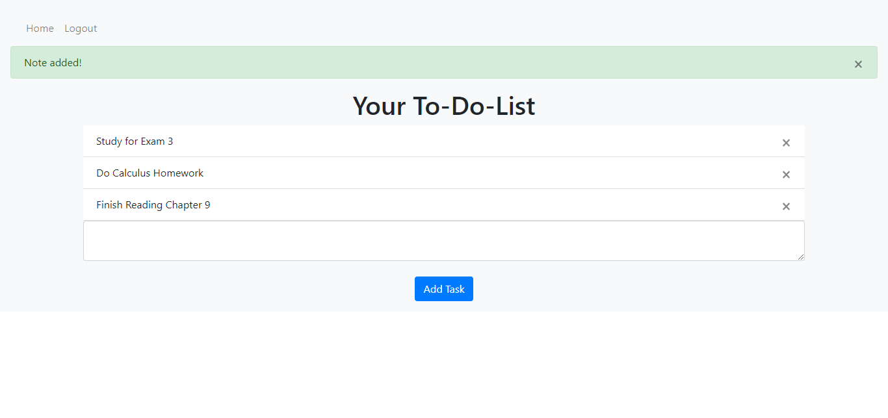

# To-Do-List Python Website

This is a website I created to keep track of tasks I have to do throughout my day. I can use this program to differentiate the tasks I must do as a college student and young adult. This program allows users to create a login with a specific email and track their tasks with that specific email. Users can create an account with their work email and keep track of the associated task with that email. Users can also create an account with their personal email and keep track of tasks associated with their personal email. Below you will see the details initiated by this project. 


## What I Learned/Project Covers

```
- Directory Structure
- Creating Routes/Views
- Jinja Templating Language & HTML Templates
- Login & Sign Up Page HTML 
- HTTP Requests (POST, GET, etc.)
- Handling POST Requests
- Flask SQLAlchemy Setup
- Database Models, Foreign Key Relationships, & Database Creation
- Creating New User Accounts & Logging In Users 
- Checking if User is Logged In & Notes HTML
- Adding User Notes & Deleting User Notes
```


## Pictures

Login Screen:
 

Sign Up Screen:
 

Task Screen (Add + Remove):
 


## Setup 

Make sure you have the latest version of Python installed.


## Requirments (Install)
```
pip install flask
pip install Flask-SQLAlchemy
pip install flask-login
```

## Viewing The Website

Go to `http://127.0.0.1:5000`

xffffffffffffffffdf
